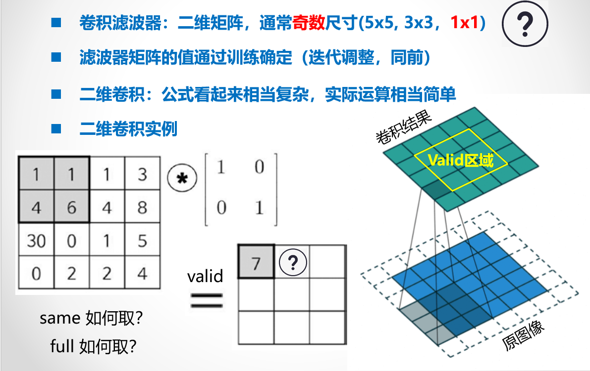
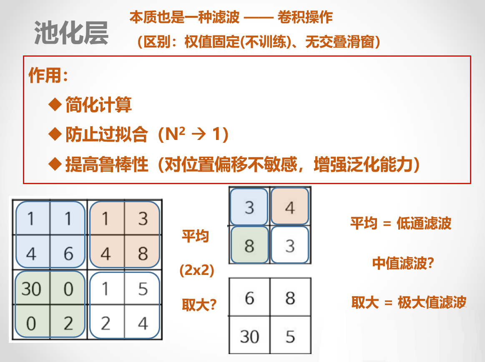
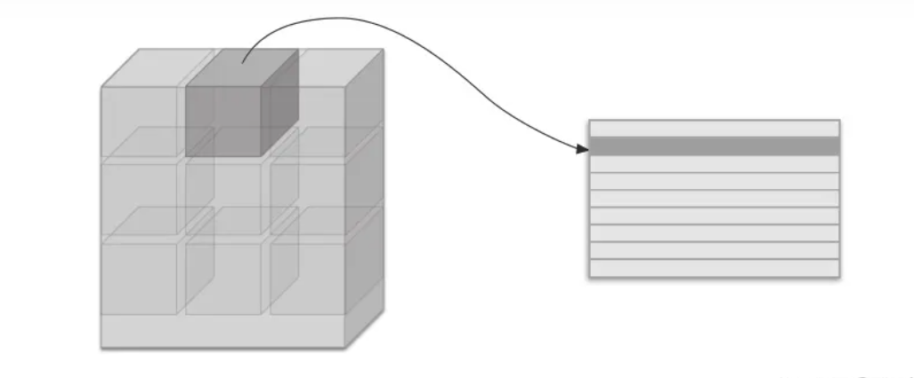
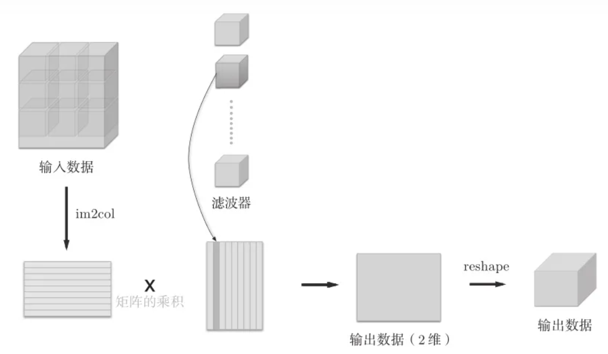
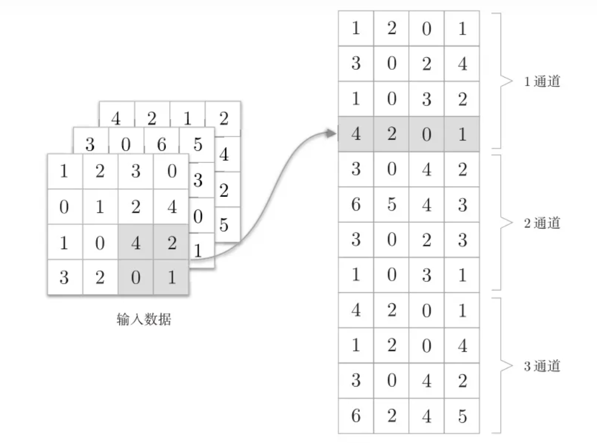
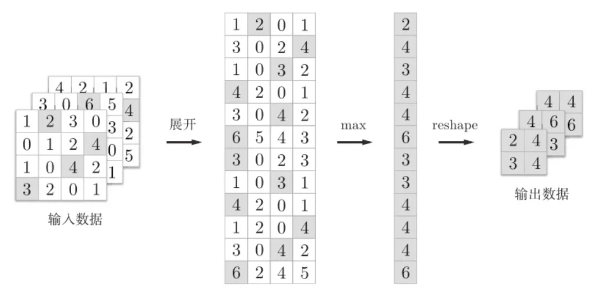

# CNN Framework

一个使用 numpy 实现的简单的神经网络框架（超级简单！！！），没什么用，就当是纪念一下吧。

由于某次[作业](https://github.com/BeiYazi0/DL_homework/tree/main/SP)要求不能使用框架，只好痛苦地写出了这个奇怪的东西，本 README 也是该作业 README 的一部分。
---

已经更新循环层，用于[作业](https://github.com/BeiYazi0/DL_homework/tree/main/SP2)。

---

使用本框架完成手写数字识别的代码大致如下

```python
from cnn.layers import *
from cnn.models import Model, load_model
from cnn.utils.visualization import history_show, confusion_show
import numpy as np
from scipy.io import loadmat
import time

data = loadmat('data/MNISTData.mat')

X_train = data['X_Train']
X_test = data['X_Test']
y_train = data['D_Train'].astype(np.int32)
y_test = data['D_Test'].astype(np.int32)

X_train = np.expand_dims(X_train.transpose(2,0,1), axis=1)
X_test = np.expand_dims(X_test.transpose(2,0,1), axis=1)
y_train = y_train.T
y_test = y_test.T

input_layer = Input((1, 28, 28))
model = Model(input_layer, "MNIST_cnn")

# 添加网络层
model.add_layer(Conv2D(20, 9, input_shape = (1, 28, 28), activate_fcn = "ReLU"))
model.add_layer(AveragePooling2D(2, input_shape = (20, 20, 20)))
model.add_layer(Flatten((20, 10, 10)))
model.add_layer(Dense(100, 2000, activate_fcn = "ReLU"))
model.add_layer(Output(10, 100))

model.compile(0.01, "cross_tropy")

T1 = time.time()
history = model.fit(X_train, y_train, batch_size = 32, epochs = 3, verbose = 1, shuffle = True)
T2 = time.time()
print('训练用时:%s分' % ((T2 - T1) / 60))

print(f"模型在测试集上的表现\n{model.evaluate(X_test, y_test)}")
history_show(history)
labels = ["0", "1", "2", "3", "4", "5", "6", "7", "8", "9"]
confusion_show(labels, model.predict_classes(X_test), y_test.argmax(axis = 1))

model.save("model\\MNIST_cnn.h5")
```

尽量伪装的像一个正经的框架哈。

---

# 目录

<ul class="toc-item"></ul></li><li><span><i class="fa fa-fw fa-caret-down"></i><a href="#1.要求" data-toc-modified-id="1.构成"><span class="toc-item-num">&nbsp;&nbsp;</span>1.构成</a></span></li></ul></ul></li><li><span><i class="fa fa-fw fa-caret-down"></i><a href="#2.准备工作" data-toc-modified-id="2.准备工作"><span class="toc-item-num">&nbsp;&nbsp;</span>2.准备工作</a></span><ul class="toc-item"><li><span><i class="fa fa-fw"></i><a href="#2.1导入依赖。" data-toc-modified-id="2.1导入依赖"><span class="toc-item-num">&nbsp;&nbsp;</span>2.1导入依赖。</a></span></li><li><span><i class="fa fa-fw fa-caret-down"></i><a href="#2.2-激活函数" data-toc-modified-id="2.2-激活函数"><span class="toc-item-num">&nbsp;&nbsp;</span>2.2 激活函数</a></span><ul class="toc-item"><li><span><i class="fa fa-fw"></i><a href="#2.2.1-ReLU-&amp;-Sigmoid-&amp;-Softmax" data-toc-modified-id="2.2.1-ReLU-&amp;-Sigmoid-&amp;-Softmax"><span class="toc-item-num">&nbsp;&nbsp;</span>2.2.1 ReLU &amp; Sigmoid &amp; Softmax</a></span></li><li><span><i class="fa fa-fw"></i><a href="#2.2.2-激活函数的梯度的函数" data-toc-modified-id="2.2.2-激活函数的梯度的函数"><span class="toc-item-num">&nbsp;&nbsp;</span>2.2.2 激活函数的梯度的函数</a></span></li></ul></li></ul></li><li><span><i class="fa fa-fw fa-caret-down"></i><a href="#3.CNN构成" data-toc-modified-id="3.CNN构成"><span class="toc-item-num">&nbsp;&nbsp;</span>3.CNN构成</a></span><ul class="toc-item"><li><span><i class="fa fa-fw"></i><a href="#3.1-卷积层" data-toc-modified-id="3.1-卷积层"><span class="toc-item-num">&nbsp;&nbsp;</span>3.1 卷积层</a></span></li><li><span><i class="fa fa-fw"></i><a href="#3.2-池化层" data-toc-modified-id="3.2-池化层"><span class="toc-item-num">&nbsp;&nbsp;</span>3.2 池化层</a></span></li><li><span><i class="fa fa-fw"></i><a href="#3.3-im2col" data-toc-modified-id="3.3-im2col"><span class="toc-item-num">&nbsp;&nbsp;</span>3.3 im2col</a></span></li><li><span><i class="fa fa-fw"></i><a href="#3.4-卷积和池化的高效实现" data-toc-modified-id="3.4-卷积和池化的高效实现"><span class="toc-item-num">&nbsp;&nbsp;</span>3.4 卷积和池化的高效实现</a></span></li></ul></li><li><span><i class="fa fa-fw fa-caret-down"></i><a href="#4.构建神经网络" data-toc-modified-id="4.构建神经网络"><span class="toc-item-num">&nbsp;&nbsp;</span>4.构建神经网络</a></span><ul class="toc-item"><li><span><i class="fa fa-fw"></i><a href="#4.1-前向传播" data-toc-modified-id="4.1-前向传播"><span class="toc-item-num">&nbsp;&nbsp;</span>4.1 前向传播</a></span></li><li><span><i class="fa fa-fw fa-caret-down"></i><a href="#4.2-反向传播" data-toc-modified-id="4.2-反向传播"><span class="toc-item-num">&nbsp;&nbsp;</span>4.2 反向传播</a></span><ul class="toc-item"><li><span><i class="fa fa-fw"></i><a href="#4.2.1-卷积层的反向传播" data-toc-modified-id="4.2.1-卷积层的反向传播"><span class="toc-item-num">&nbsp;&nbsp;</span>4.2.1 卷积层的反向传播</a></span></li><li><span><i class="fa fa-fw"></i><a href="#4.2.2-池化层的反向传播" data-toc-modified-id="4.2.2-池化层的反向传播"><span class="toc-item-num">&nbsp;&nbsp;</span>4.2.2 池化层的反向传播</a></span></li><li><span><i class="fa fa-fw"></i><a href="#4.2.3-flatten-层的反向" data-toc-modified-id="4.2.3-flatten-层的反向"><span class="toc-item-num">&nbsp;&nbsp;</span>4.2.3 flatten 层的反向</a></span></li><li><span><i class="fa fa-fw"></i><a href="#4.2.4-隐层的反向传播" data-toc-modified-id="4.2.4-隐层的反向传播"><span class="toc-item-num">&nbsp;&nbsp;</span>4.2.4 隐层的反向传播</a></span></li></ul></li><li><span><i class="fa fa-fw"></i><a href="#4.3-损失函数" data-toc-modified-id="4.3-损失函数"><span class="toc-item-num">&nbsp;&nbsp;</span>4.3 损失函数</a></span></li><li><span><i class="fa fa-fw"></i><a href="#4.4-层类" data-toc-modified-id="4.4-层类"><span class="toc-item-num">&nbsp;&nbsp;</span>4.4 层类</a></span></li><li><span><i class="fa fa-fw"></i><a href="#4.5-model" data-toc-modified-id="4.5-model"><span class="toc-item-num">&nbsp;&nbsp;</span>4.5 model</a></span></li><li><span><i class="fa fa-fw fa-caret-down"></i><a href="#4.6-模型保存和加载" data-toc-modified-id="4.6-模型保存和加载"><span class="toc-item-num">&nbsp;&nbsp;</span>4.6 模型保存和加载</a></span><ul class="toc-item"><li><span><i class="fa fa-fw"></i><a href="#4.6.1-模型保存" data-toc-modified-id="4.6.1-模型保存"><span class="toc-item-num">&nbsp;&nbsp;</span>4.6.1 模型保存</a></span></li><li><span><i class="fa fa-fw"></i><a href="#4.6.2-模型加载" data-toc-modified-id="4.6.2-模型加载"><span class="toc-item-num">&nbsp;&nbsp;</span>4.6.2 模型加载</a></span></li></ul></li><li><span><i class="fa fa-fw fa-caret-down"></i><a href="#4.7-可视化" data-toc-modified-id="4.7-可视化"><span class="toc-item-num">&nbsp;&nbsp;</span>4.7 可视化</a></span><ul class="toc-item"><li><span><i class="fa fa-fw"></i><a href="#4.7.1-accuracy-&amp;-loss-可视化" data-toc-modified-id="4.7.1-accuracy-&amp;-loss-可视化"><span class="toc-item-num">&nbsp;&nbsp;</span>4.7.1 accuracy &amp; loss 可视化</a></span></li><li><span><i class="fa fa-fw"></i><a href="#4.7.2-混淆矩阵可视化" data-toc-modified-id="4.7.2-混淆矩阵可视化"><span class="toc-item-num">&nbsp;&nbsp;</span>4.7.2 混淆矩阵可视化</a></span></li></ul></li><li><span><i class="fa fa-fw"></i><a href="#4.8-测试" data-toc-modified-id="4.8-测试"><span class="toc-item-num">&nbsp;&nbsp;</span>4.8 测试</a></span></li></ul>
---

## 1. 构成

构成如下:

1. activations
    - __init__.py
    - activate_fcn.py
2. layers
    - __init__.py
    - AveragePooling.py 
    - Convolutional.py 
    - Dense.py 
    - Flatten.py 
    - Input.py 
    - MaxPooling.py 
    - Output.py
    - Recurrent.py
3. losses
    - __init__.py 
    - loss.py
4. models
    - __init__.py 
    - model.py 
    - modelLoad.py 
    - modelSave.py
5. utils
    - __init__.py 
    - im2col.py 
    - nndict.py 
    - standard.py 
    - weight_initialization.py
    - visualization.py

---

## 2. 准备工作

### 2.1导入依赖。


```python
import numpy as np
import matplotlib.pyplot as plt
from scipy.signal import convolve2d
```

### 2.2 激活函数

见 [activate](cnn/activations/activate_fcn.py)

#### 2.2.1 ReLU & Sigmoid & Softmax


```python
def ReLU(z):
    '''
    ReLU 函数
    Args:
        z (m, n): 输入
    Returns:
        g (m, n): ReLU 函数输出
    '''
    return np.maximum(0, z)

def sigmoid(z):
    '''
    sigmoid 函数
    Args:
        z (m, n): 输入
    Returns:
        g (m, n): sigmoid 函数输出
    '''
    d = 1 + np.exp(-z)
    return 1. / d

def softmax(z):
    '''
    softmax 函数
    Args:
        z (m, n): 输入
    Returns:
        g (m, n): softmax 函数输出
    '''
    d = np.exp(z)
    # 注意 d sum时的axis
    return d / d.sum(axis = 1).reshape(-1, 1)
```

#### 2.2.2 激活函数的梯度的函数


```python
def ReLU_gradient(z):
    return z > 0

def sigmoid_gradient(z):
    return np.multiply(sigmoid(z), (1 - sigmoid(z)))

def softmax_gradient(z):
    return np.multiply(softmax(z), (1 - softmax(z)))
```

---

## 3. CNN 构成

### 3.1 卷积层

卷积层的实现原理如图所示，由于较为简单，这里就不再赘述了。



首先尝试使用 scipy.signal.convolve2d 实现二维卷积。

注意 convolve2d 会将卷积核翻转（上下、左右颠倒），因此我们预先翻转卷积核以避免。

见 [conv_standard](cnn/utils/standard.py)


```python
def conv(x, kernel, padding = 0):
    '''
    卷积
    Args:
        x (N, C, H, W): 输入
        kernel (out_k, C, kH, kW): 卷积核
        padding int: 模式——0：valid; 1: same; 2: full.
    Returns:
        z (N, out_k, out_h, out_w): 卷积结果
    '''
    mode = ["valid", "same", "full"]
    mode = mode[padding]
    
    # 根据模式进行填充
    p = padding
    x_padded = np.pad(x, ((0, 0), (0, 0), (p, p), (p, p)), mode = "constant")
    
    # 确定输出的大小
    N, C, H, W = x.shape
    out_k, C, kH, kW = kernel.shape
    out_h = (H + 2 * padding - kH) + 1
    out_w = (W + 2 * padding - kW) + 1
    
    # 卷积实现
    z = np.zeros((N, out_k, out_h, out_w))
    for i in range(N):
        for j in range(out_k):
            for ci in range(C):
                z[i, j] += convolve2d(x[i, ci], kernel[j, ci, ::-1, ::-1], 
                                      boundary = 'fill', mode = mode, fillvalue = 0)
    return z
```

### 3.2 池化层

池化分为最大池化和平均池化，它们的实现原理如图所示，由于较为简单，这里就不再赘述了。

最大池化需要在进行前向传播时记录下最大值神经元的Max_ID位置，详细理由将在反向传播部分论述。

见 [pool_standard](cnn/utils/standard.py)




```python
def average_pool(x, kernel_shape):
    '''
    平均池化
    Args:
        x (N, C, H, W): 输入
        kernel_shape tuple(int): 池化层参数
    Returns:
        z (N, C, out_h, out_w): 池化结果
    '''
    # 确定输出的大小
    N, C, H, W = x.shape
    kH, kW = kernel_shape
    out_h = H // kH
    out_w = W // kW
    
    # 平均池化
    z = np.zeros((N, C, out_h, out_w))
    for i in range(kH):
        for j in range(kW):
            z += x[:, :, i::kH, j::kW]
    
    return z/(kH * kW)

def max_pool(x, kernel_shape):
    '''
    最大池化
    Args:
        x (N, C, H, W): 输入
        kernel_shape tuple(int): 池化层参数
    Returns:
        z (N, C, out_h, out_w): 池化结果
        max_id (N, C, out_h, out_w): 最大值神经元的 Max_ID位置
    '''
    # 确定输出的大小
    N, C, H, W = x.shape
    kH, kW = kernel_shape
    out_h = H // kH
    out_w = W // kW
    
    # 最大池化
    z = np.zeros((N, C, out_h, out_w))
    max_id = np.zeros((N, C, out_h, out_w))
    for i in range(kH):
        for j in range(kW):
            target = x[:, :, i::kH, j::kW]
            mask = target > z
            max_id = max_id * (~mask) + mask * (i * kH + j)
            z = z * (~mask) + mask * target
    
    return z, max_id

def pool(x, kernel_shape, mode = 0):
    '''
    池化
    Args:
        x (N, C, H, W): 输入
        kernel_shape tuple(int): 池化层参数
        mode int: 0-平均池化; 1-最大池化
    Returns:
        z (N, C, out_h, out_w): 池化结果
    '''
    if mode == 0:
        return average_pool(x, kernel_shape)
    else:
        return max_pool(x, kernel_shape)
```

### 3.3 im2col

本部分参考[深度学习入门-卷积神经网络（三）实现](https://zhuanlan.zhihu.com/p/259806556)。

CNN中处理的是4维数据，因此卷积运算的实现看上去会很复杂，但是通过使用下面要介绍的 im2col （image to column）这个技巧，问题就会变得很简单。

im2col 是一个函数，将输入数据展开以适合滤波器（权重）。如图所示，对3维的输入数据应用 im2col 后，数据转换为2维矩阵。



为了便于观察，将步幅设置得很大，以使滤波器的应用区域不重叠。而在实际的卷积运算中，滤波器的应用区域几乎都是重叠的。在滤波器的应用区域重叠的情况下，使用 im2col 展开后，展开后的元素个数会多于原方块的元素个数。因此，使用 im2col 的实现存在比普通的实现消耗更多内存的缺点。

使用 im2col 展开输入数据后，之后就只需将卷积层的滤波器（权重）纵向展开为1列，并计算2个矩阵的乘积即可。



池化层的实现和卷积层相同，都使用 im2col 展开输入数据。不过，池化的情况下，在通道方向上是独立的，这一点和卷积层不同。具体地讲，如图所示，池化的应用区域按通道单独展开。



对于最大池化，展开之后，只需对展开的矩阵求各行的最大值，并转换为合适的形状即可。



对于平均池化，展开之后，只需对展开的矩阵求各行的平均值，并转换为合适的形状即可。

见 [im2col](cnn/utils/im2col.py)


```python
def get_im2col_indices(x_shape, field_height, field_width, padding=0, stride=1):
    '''
    im2col 的高效实现
    Args:
        x_shape tuple(int): 样本数、图像通道数、图像高度、图像宽度
        field_height int: 卷积核高
        field_width int: 卷积核宽
        padding int: 模式——0：valid; 1: same; 2: full.
        stride int: 步长
    Returns:
        tuple((field_height*field_width*C, 1),
        (field_height*field_width*C, out_height*out_width),
        (field_height*field_width*C, out_height*out_width)): 索引
    '''
    N, C, H, W = x_shape
    
    # 卷积输出的大小
    out_height = (H + 2 * padding - field_height) // stride + 1
    out_width = (W + 2 * padding - field_width) // stride + 1

    ## 生成行索引
    # 卷积核框住区域中，所有元素的行索引相对被框住区域左上角元素的偏移量（从左到右，从上到下）
    i0 = np.repeat(np.arange(field_height), field_width) 
    # 复制i0，次数为通道数
    i0 = np.tile(i0, C)
    # 卷积运算时，每个框选区域的左上角元素的行索引
    i1 = stride * np.repeat(np.arange(out_height), out_width)
    
    ## 生成列索引
    # 卷积核框住区域中，所有元素的列索引相对被框住区域左上角元素的偏移量（从左到右，从上到下）， 复制C次
    j0 = np.tile(np.arange(field_width), field_height * C)
    # 卷积运算时，每个框选区域的左上角元素的列索引
    j1 = stride * np.tile(np.arange(out_width), out_height)
    
    ## 生成行列的二维索引
    i = i0.reshape(-1, 1) + i1.reshape(1, -1) # i[m, :]表示参加第m次卷积运算的所有元素的行索引
    j = j0.reshape(-1, 1) + j1.reshape(1, -1) # j[m, :]表示参加第m次卷积运算的所有元素的列索引

    ## 生成通道数索引
    # 卷积核框住区域中，所有元素的通道数索引相对被框住区域左上角元素的偏移量（从左到右，从上到下，从通道0到C）
    k = np.repeat(np.arange(C), field_height * field_width).reshape(-1, 1)

    return (k, i, j)


def im2col_indices(x, field_height, field_width, padding=0, stride=1):
    '''
    im2col
    Args:
        x (N, C, H, W): 输入
        field_height int: 卷积核高
        field_width int: 卷积核宽
        padding int: 模式——0：valid; 1: same; 2: full.
        stride int: 步长
    Returns:
        cols (field_height*field_width*C, out_height*out_width*N): 与卷积核相乘实现卷积的的矩阵
    '''
    # 根据模式进行填充
    p = padding
    x_padded = np.pad(x, ((0, 0), (0, 0), (p, p), (p, p)), mode="constant")

    # 获取cols对应的索引值
    k, i, j = get_im2col_indices(x.shape, field_height, field_width, padding, stride)

    cols = x_padded[:, k, i, j]
    C = x.shape[1]
    # 满足 W.T @ cols = output
    return cols.transpose(1, 0, 2).reshape(field_height * field_width * C, -1)

def col2im_indices(cols, x_shape, field_height=3, field_width=3, padding=0, stride=1):
    '''
    col2im，将 col 还原
    Args:
        cols (field_height*field_width*C, out_height*out_width*N): 与卷积核相乘实现卷积的的矩阵
        x_shape tuple(int): 样本数、图像通道数、图像高度、图像宽度
        field_height int: 卷积核高
        field_width int: 卷积核宽
        padding int: 模式——0：valid; 1: same; 2: full.
        stride int: 步长
    Returns:
        x (N, C, H_padded, W_padded): 原输入
    '''
    
    N, C, H, W = x_shape
    H_padded, W_padded = H + 2 * padding, W + 2 * padding
    x_padded = np.zeros((N, C, H_padded, W_padded), dtype=cols.dtype)
    
    # 获取cols对应的索引值
    k, i, j = get_im2col_indices(x_shape, field_height, field_width, padding, stride)
    cols_reshaped = cols.reshape(C * field_height * field_width, -1, N)
    cols_reshaped = cols_reshaped.transpose(2, 0, 1)
    np.add.at(x_padded, (slice(None), k, i, j), cols_reshaped)
    
    if padding == 0:
        return x_padded
    return x_padded[:, :, padding:-padding, padding:-padding]
```

### 3.4 卷积和池化的高效实现

首先实现 im2col 下的卷积和池化。


```python
def conv_im2col(x, kernel, padding = 0, stride=1):
    '''
    卷积的高效实现
    Args:
        x (N, C, H, W): 输入
        kernel (out_k, C, kH, kW): 卷积核
        padding int: 模式——0：valid; 1: same; 2: full.
        stride int: 步长
    Returns:
        z (N, out_k, out_h, out_w): 卷积结果
    '''
    N, C, H, W = x.shape
    out_k, C, kH, kW = kernel.shape
    out_h = (H + 2 * padding - kH) // stride + 1
    out_w = (W + 2 * padding - kW) // stride + 1
    
    # im2col
    x_col = im2col_indices(x, kH, kW, padding, stride)
    kernel_col = kernel.reshape(out_k, -1)
    
    # 卷积实现
    z = kernel_col @ x_col
    
    return z.reshape(out_k, N, out_h, out_w).transpose(1, 0, 2, 3)


def average_pool_im2col(x, kernel_shape):
    '''
    平均池化的高效实现
    Args:
        x (N, C, H, W): 输入
        kernel (kH, kW): 池化核 (kH == KW)
    Returns:
        z (N, out_k, out_h, out_w): 卷积结果
    '''
    N, C, H, W = x.shape
    kH, kW = kernel_shape
    stride = kH
    out_h = H // stride
    out_w = W // stride
    
    # im2col
    x_col = im2col_indices(x, kH, kW, 0, stride).reshape(C, kH*kW, -1)
    
    # 平均池化
    z = x_col.mean(axis = 1)
    
    return z.reshape(C, N, out_h, out_w).transpose(1, 0, 2, 3)

def max_pool_im2col(x, kernel_shape):
    '''
    最大池化的高效实现
    Args:
        x (N, C, H, W): 输入
        kernel (kH, kW): 池化核 (kH == KW)
    Returns:
        z (N, out_k, out_h, out_w): 卷积结果
        max_id (N, C, out_h, out_w): 最大值神经元的 Max_ID位置
    '''
    N, C, H, W = x.shape
    kH, kW = kernel_shape
    stride = kH
    out_h = H // stride
    out_w = W // stride
    
    # im2col
    x_col = im2col_indices(x, kH, kW, 0, stride).reshape(C, kH*kW, -1)
    
    # 最大池化
    max_id = x_col.argmax(axis = 1)
    z = x_col.max(axis = 1)
    
    return z.reshape(C, N, out_h, out_w).transpose(1, 0, 2, 3), max_id.reshape(C, N, out_h, out_w).transpose(1, 0, 2, 3)

def pool_im2col(x, kernel_shape, mode = 0):
    '''
    池化的高效实现
    Args:
        x (N, C, H, W): 输入
        kernel_shape tuple(int): 池化层参数
        mode int: 0-平均池化; 1-最大池化
    Returns:
        z (N, C, out_h, out_w): 池化结果
    '''
    if mode == 0:
        return average_pool_im2col(x, kernel_shape)
    else:
        return max_pool_im2col(x, kernel_shape)
```

下面的测试中，我们将证明应用 im2col 后，得到的结果是正确的（两个 array 各元素误差之和极其小）。

测试的数据为 X_train 的前 100 个样本。


```python
# 生成卷积核
kernel = np.random.randn(20, 1, 9, 9)

# 卷积输出
test = conv(X_train[:100], kernel)

# 使用 im2col 实现卷积
test_im2col = conv_im2col(X_train[:100], kernel, padding=0, stride=1)

# 总误差
print(f"卷积输出error: {np.sum(test-test_im2col)}")

# 平均池化
test = pool(X_train[:100], (2,2), mode = 0)
test_im2col = pool_im2col(X_train[:100], (2,2), mode = 0)
print(f"平均池化error: {np.sum(test-test_im2col)}")

# 最大池化
test = pool(X_train[:100], (2,2), mode = 1)
test_im2col = pool_im2col(X_train[:100], (2,2), mode = 1)
print(f"最大池化error: {np.sum(test[0]-test_im2col[0])}\n最大池化id error: {np.sum(test[1]-test_im2col[1])}")
```

    卷积输出error: 5.064037844319954e-12
    平均池化error: 0.0
    最大池化error: 0.0
    最大池化id error: 0.0
    

接下来，我们需要比较两者的运行性能。

测试的数据为 X_train 的前 100 个样本。


```python
%timeit conv(X_train[:100], kernel)

%timeit conv_im2col(X_train[:100], kernel, padding=0, stride=1)
```

    169 ms ± 1.47 ms per loop (mean ± std. dev. of 7 runs, 10 loops each)
    22.3 ms ± 1.7 ms per loop (mean ± std. dev. of 7 runs, 10 loops each)
    


```python
%timeit pool(X_train[:1000], (14,14), mode = 0)

%timeit pool_im2col(X_train[:1000], (14,14), mode = 0)
```

    4.33 ms ± 412 µs per loop (mean ± std. dev. of 7 runs, 100 loops each)
    8.69 ms ± 92.5 µs per loop (mean ± std. dev. of 7 runs, 100 loops each)
    


```python
%timeit pool(X_train[:100], (14,14), mode = 1)

%timeit pool_im2col(X_train[:100], (14,14), mode = 1)
```

    2.64 ms ± 47.6 µs per loop (mean ± std. dev. of 7 runs, 100 loops each)
    842 µs ± 7.8 µs per loop (mean ± std. dev. of 7 runs, 1000 loops each)
    

可以看到，在 100 个样本的情况下，conv_im2col 的耗时约为 conv 的 1/7。这说明卷积运算的计算量较大，使用 im2col 可以将卷积运算转化为计算量相对较小的矩阵乘法。

然而， average_pool_im2col 耗时却大于 average_pool， 这是因为 im2col 以及将结果 reshape 都需要一定的开销，池化的计算量较小，使用 im2col 技巧并不显得高效，反而增加了耗时。

当池化核较大时，max_pool_im2col 耗时远低于 max_pool，这是因为对于 col 来说获取 max_id 的运算更为简单。

---

## 4. 构建神经网络


### 4.1 前向传播

偏置 b = 0。

前面已经实现了卷积层和池化层的前向传播， 接下来我们将实现 flatten 层和 hidden 层的前向传播。

flatten层用来将输入“压平”，即把多维的输入一维化，常用在从卷积层到全连接层的过渡。flatten不影响batch的大小。


```python
def flatten_forward(x):
    '''
    flatten 
    Args:
        x (N, C, H, W): 输入
    Returns:
        z (N, C*H*W): flatten 输出
    '''
    N = x.shape[0]
    return x.reshape(N, -1)

def hidden_forward(x, theta, activate_fcn):
    '''
    hidden
    Args:
        x (m, n): m 个样本，n个特征
        theta (t, n): t 个输出神经元，n个输入神经元
        activate_fcn method: 激活函数
    Returns:
        z (m, t): 输出
        a (m, t): 激活输出
    '''
    z = x @ theta.T
    a = activate_fcn(z)
    
    return z, a
```

### 4.2 反向传播

#### 4.2.1 卷积层的反向传播

更新卷积层的系数。

[PNG](./img/conv_bp.PNG)

梯度穿越卷积层

[PNG](./img/conv_bp2.PNG)


```python
def conv_bp(x, z, error, kernel, activate_fcn_gradient):
    '''
    卷积层系数更新和反向传播
    Args:
        x (N, C, H, W): 正向传播中卷积层的输入
        z (N, out_k, out_h, out_w): 正向传播中卷积层的输出
        error (N, out_k, out_h, out_w): 从下一层反向传播而来的误差
        kernel (out_k, C, KH, KW): 卷积核
        activate_fcn_gradient method: 激活函数的梯度函数
        bp_flag boolean: 是否执行反向传播
    Returns:
        grad (out_k, C, KH, KW): 卷积层系数的梯度
        error_bp (N, C, H, W): 卷积层向上一层反向传播的误差
    '''
    N, C, H, W = x.shape
    
    # 计算delta
    delta = np.multiply(error, activate_fcn_gradient(z))
    
    # 计算 grad
    grad = conv_im2col(x.transpose(1, 0, 2, 3), 
                       delta.transpose(1, 0, 2, 3)).transpose(1, 0, 2, 3) / N
    
    # 反向传播
    error_bp = conv_im2col(delta, kernel.transpose(1, 0, 2, 3), padding = kernel.shape[-1]-1)
    
    return grad, error_bp
```

测试

可以看到，卷积层反向传播的梯度和误差完全正确。


```python
from cnn.utils.standard import conv_bp_standard
conv_bp_standard??
```


```python
kernel = np.random.randn(2, 3, 9, 9)
x = np.random.randn(10, 3, 28, 28)
z = conv_im2col(x, kernel)
error = np.random.randn(10, 2, 20, 20)

grad, error_bp = conv_bp_standard(x, z, error, kernel, ReLU_gradient)
test_bp = conv_bp(x, z, error, kernel, ReLU_gradient)

print(f"grad error: {np.sum(grad - test_bp[0])}")
print(f"error_bp error: {np.sum(error_bp - test_bp[1])}")
```

    grad error: 7.305636130772175e-14
    error_bp error: 4.794602215252297e-14
    

#### 4.2.2 池化层的反向传播

由于池化层的系数无需变化，因此只需要将误差反向传播即可。

对于平均池化，其前向传播是取某特征区域的平均值进行输出，这个区域的每一个神经元都是有参与前向传播了的，因此，在反向传播时，框架需要将梯度平均分配给每一个神经元再进行反向传播。

对于最大池化，其前向传播是取某特征区域的最大值进行输出，这个区域仅有最大值神经元参与了前向传播，因此，在反向传播时，框架仅需要将该区域的梯度直接分配到最大值神经元即可，其他神经元的梯度被分配为0且是被舍弃不参与反向传播的，但如何确认最大值神经元，这个还得框架在进行前向传播时记录下最大值神经元的 Max_ID 位置，这是最大池化与平均池化差异的地方。


```python
def average_pool_backward(error, kernel_shape):
    '''
    平均池化的反向传播
    Args:
        error (N, out_k, out_h, out_w): 从下一层反向传播来的误差
        kernel_shape tuple(int): 池化核 (kH == KW)
    Returns:
        error_bp (N, out_k, KH * out_h, KW * out_w): 向上一层反向传播的误差
    '''
    KH, KW = kernel_shape
    # delta = error
    return error.repeat(KH, axis = -2).repeat(KW, axis = -1) / (KH * KW)

def max_pool_backward(error, max_id, kernel_shape):
    '''
    最大池化的反向传播
    Args:
        error (N, out_k, out_h, out_w): 从下一层反向传播来的误差
        max_id (N, out_k, out_h, out_w): 最大值神经元的 Max_ID 位置
        kernel_shape tuple(int): 池化核 (kH == KW)
    Returns:
        error_bp (N, out_k, KH * out_h, KW * out_w): 向上一层反向传播的误差
    '''
    N, out_k, out_h, out_w = error.shape
    KH, KW = kernel_shape

    ## 使用 mask 使得扩展后的 max_id 只有在索引位置和值相对应时为 True
    max_id = max_id.repeat(KH, axis = -2).repeat(KW, axis = -1)
    mask = np.tile(np.arange(KH * KW).reshape(KH, KW), [out_h, out_w])
    
    # delta = error
    return error.repeat(KH, axis = -2).repeat(KW, axis = -1) * (max_id == mask)
```

测试

由于平均池化的反向传播较为简单，这里仅测试最大池化的反向传播。


```python
error = np.random.randn(3, 3, 8, 8)
max_id = np.random.randint(0, 4, (3, 3, 8, 8))
test = np.zeros((3, 3, 16, 16))
for i in range(3):
    for j in range(3):
        row = max_id[i, j] // 2 + np.arange(8).reshape(-1, 1) * 2
        col = max_id[i, j] % 2 + np.arange(8).reshape(1, -1) * 2
        test[i, j, row, col] = error[i, j]
test_bp = max_pool_backward(error, max_id, (2, 2))
print(f"max_pool error: {np.sum(test - test_bp)}")
```

    max_pool error: 0.0
    

#### 4.2.3 flatten 层的反向

将 error 恢复为输入 flatten 层前的形状。


```python
def flatten_backford(error, input_shape):
    '''
    flatten reverse
    Args:
        error (N, -1): 从下一层反向传播来的误差
        input_shape (C, H, W): 输入 flatten 层前的形状
    Returns:
        error_bp (N, C, H, W): 向上一次反向传播的误差
    '''
    C, H, W = input_shape
    
    return error.reshape((error.shape[0], C, H, W))
```

测试


```python
x = np.random.randn(10, 3, 5, 5)
test = flatten_backford(flatten_forward(x), x.shape[1:])
print(f"flatten_backford error: {np.sum(x - test)}")
```

    flatten_backford error: 0.0
    

#### 4.2.4 隐层的反向传播

该部分较为简单，已经在前面的练习中实现，不再赘述。


```python
def hidden_backward(z, a, error, theta, activate_fcn_gradient, outflag = False):
    '''
    隐层系数更新和反向传播
    Args:
        z (m, t): 正向传播中隐层的输出
        a (m, n): 正向传播中隐层的输入
        error (m, t): 从下一层反向传播而来的误差
        theta (t, n): 参数矩阵
        activate_fcn_gradient method: 激活函数的梯度函数
        outflag boolean: 是否是输出层
    Returns:
        grad (n, t): 隐层系数的梯度
        error_bp (m, n): 隐层向上一层反向传播的误差
    '''
    m = z.shape[0]
    
    # 计算delta
    if outflag: # 交叉熵 + softmax
        delta = error
    else:
        delta = np.multiply(error, activate_fcn_gradient(z))
    
    # 计算 grad
    grad = delta.T @ a 
    
    # 反向传播
    error_bp = delta @ theta
    
    return grad, error_bp
```

### 4.3 损失函数

详见 [loss](cnn/losses/loss.py)

交叉熵损失


```python
def cross_tropy(h, y):
    '''
    交叉熵代价函数
    Args:
        h (m, k): 输出
        y (m, k): 真实值, k个类别
    Returns:
        cost float: 代价
    '''
    m = y.shape[0]
    
    # compute the cost
    J = np.multiply(-y, np.log(h)) - np.multiply((1 - y), np.log(1 - h))
    cost = np.sum(J) / m

    return cost
```

### 4.4 层类

构建神经网络的构件类。

包括 Input, Conv2D, MaxPooling2D, AveragePooling2D, Flatten, Dense, Output。

见[layers](cnn/layers)

如 Conv2D 类，其包含

1. 成员变量：
    - kernel_shape: 卷积核shape
    - kernel: 卷积核参数
    - activate_fcn: 激活函数
    - activate_gradient_fcn: 激活函数的梯度函数
    - input_shape: 该层输入的维度
    - stride: 步长
    - padding: valid; same; full.
    - output_shape: 该层输出的维度
2. 成员方法：
    - set_input(x): 设置输入
    - conv_im2col(x, kernel, padding = 0, stride = 1): 卷积的高效实现
    - fordwrd_propagate(): 前向传播
    - conv_bp(x, z, error, kernel, activate_fcn_gradient): 卷积层系数更新和反向传播
    - backward_propagate(error, lr): 反向传播
    - summary(): 返回层类型、输入数据维度、参数量
    - save(): 返回用于构建卷积层的参数及卷积核的参数

其余层的成员变量和方法同卷积层大同小异，可以通过下述命令进行查看。


```python
from cnn.layers import Conv2D

Conv2D??
```


```python
class Conv2D():
    __name__ = "Conv2D"
    '''
    卷积层
    当前仅用于padding = valid, stride = 1
    '''
    def __init__(self, filters, kernel_size, activate_fcn, input_shape, 
                 stride = 1, padding = "valid"):
        '''
        Args:
            filters int: 卷积核个数
            kernel_size int: 卷积核大小
            activate_fcn string: 激活函数
            input_shape (C, H, W): 该层输入的维度
            stride int: 步长
            padding string: valid; same; full.
        '''
        _dict = NetworkDict(kernel_size)
        C, H, W = input_shape
        self.kernel_shape = (filters, input_shape[0], kernel_size, kernel_size)
        self.kernel = Kaiming_std(np.prod(input_shape), self.kernel_shape)
        self.activate_fcn = _dict.get_activate_fcn(activate_fcn)
        self.activate_gradient_fcn = _dict.get_activate_gradient_fcn(activate_fcn)
        self.input_shape = input_shape
        self.stride = stride
        self.padding = _dict.get_padding(padding)
        self.output_shape = (None, filters, (H + 2 * self.padding - kernel_size) // stride + 1, (W + 2 * self.padding - kernel_size) // stride + 1)
        
        # 输入，输出，激活项
        self.x = None
        self.z = None
        self.a = None
```

为了便于获取激活函数及其梯度函数，使用 [NetworkDict](cnn/utils/nndict.py) 类来导入相关函数，使用时只需正确输入相应的字符串即可。

另外，卷积核的初始化采用了 Kaiming 正态分布的[初始化](cnn/utils/weight_initialization.py)，而隐层参数的初始化采用了 Kaiming 均匀分布的初始化。

详见[Pytorch权重初始化方法——Kaiming、Xavier](https://blog.csdn.net/qhaaha/article/details/116141633)。

### 4.5 model

已经准备好 CNN 的构件，下面实现神经网络，其功能包括添加网络层、配置、训练、预测、评估等。

见 [model](cnn/models/model.py)

构造方法

规定了网络的输入层、当前输出的形状和神经网络的名字。

loss_fcn 由 cnn.losses 中导入。


```python
class Model():
    '''
    神经网络
    '''
    def __init__(self, Input_layer, name = "cnn"):
        '''
        Args:
            Input_layer <class 'Input'>: 输入层
            name string: Model名
        Returns:
            None
        '''
        self.input = Input_layer
        self.cur_output_shape = Input_layer.input_shape
        self.name = name
        
        self.layers = [] # 网络层
        self.lr = 0.0    # 学习率
        
        self.loss_fcn = None # 损失函数
```

添加网络层

首先判断新加入的层的输入数据维度与模型当前输出数据的维度是否匹配。

接着将网络层加入 Model 的 layers 列表中，并修改模型当前输出数据的维度。


```python
    def add_layer(self, layer):
            '''
            添加层
            Args:
                layer <class '?'>: 网络层
            Returns:
                None
            '''
            assert layer.input_shape == self.cur_output_shape
            self.layers.append(layer)
            self.cur_output_shape = layer.output_shape[1:]
```

compile

model.compile()的作用就是为搭建好的神经网络模型设置损失函数loss、优化器optimizer、准确性评价函数metrics。

例如
    - model.compile(optimizer = Adam(learning_rate=learning_rate),
                 loss = 'sparse_categorical_crossentropy',
                 metrics = ['sparse_categorical_accuracy'])

由于能力有限，在 Model 中，compile 用于指定学习率和设置损失函数。


```python
    def compile(self, learning_rate, loss_fcn = "cross_tropy"):
            '''
            设置损失函数 loss、学习率 learning_rate
            Args:
                learning_rate float: 学习率
                loss_fcn string: 损失函数
            Returns:
                None
            '''
            assert learning_rate > 1e-6 and learning_rate < 1
            self.lr = learning_rate

            loss_dic = {"cross_tropy": cross_tropy}
            self.loss_fcn = loss_dic[loss_fcn] if loss_fcn in loss_dic else MSE
```

前向传播和后向传播

由于我们已经在各个网络层对应的类中定义了前向传播和后向传播，因此只需要依次调用各层的前后向传播即可实现 Model 的前后向传播，so easy。


```python
    def forward(self):
            '''
            前向传播
            Args:
                None
            Returns:
                a (m, k): 输出
            '''
            a = self.input.fordwrd_propagate()
            for layer in self.layers:
                layer.set_input(a)
                a = layer.fordwrd_propagate()
            return a

    def backward(self, error):
        '''
        反向传播
        Args:
            error (N, k): 误差
        Returns:
            None
        '''
        for layer in self.layers[::-1]:
            error = layer.backward_propagate(error, self.lr)
```

训练

Model.fit() 将训练数据在模型中训练一定次数，返回loss和测量指标，其典型的参数如下。

|参数|含义|
|---|---|
|x	|输入|
|y	|输出|
|batch_size|每一个batch的大小（批尺寸），即训练一次网络所用的样本数|
|epochs|迭代次数，即全部样本数据将被“轮”多少次，轮完训练停止|
|verbose|0:不输出信息；1:显示进度条(一般默认为1)；2:每个epoch输出一行记录|
|validation_split|(0,1)的浮点数，分割数据当验证数据，其它当训练数据|
|validation_data|指定验证数据，该数据将覆盖validation_spilt设定的数据|
|validation_freq|指定验证数据的epoch|
|callback|在每个training/epoch/batch结束时，可以通过回调函数Callbacks查看一些内部信息|

本 Model 的参数暂未采用验证集相关参数和 callback。

值得注意的是，通过 callback 可以在训练中适当修改学习率（如每经过 30 epoch 学习率减半）。

batch_size 默认为 -1，此时为批量，另外需要注意样本数不能恰好分成 batch_size 份的情况。

shuffle 默认为 True，执行将训练模型的数据集进行打乱的操作，详见[TF模型训练中数据shuffle对模型性能的影响](https://blog.csdn.net/pearl8899/article/details/121792312)。


```python
    def fit(self, x, y, batch_size = -1, epochs = 1, verbose = 1, shuffle = True):
            '''
            训练模型
            Args:
                x (N, C, H, W): 输入
                y (N, k): 输出
                batch_size int: 每次梯度更新的样本数
                epochs int: 训练模型迭代次数
                verbose int: 日志展示
                    0:不在标准输出流输出日志信息
                    1:显示进度条
                    2:每个epoch输出一行记录
                shuffle boolean: 是否在每轮迭代之前混洗数据
            Returns:
                history dict{string: (epochs, )}: 准确率和损失历史值
            '''
            N = x.shape[0]                         # 样本数量
            batchs = int(np.ceil(N / batch_size))  # 总 batch 数
            index = np.arange(N)                   # 用于随机打乱的索引
            y_true = y.argmax(axis=1)              # label

            # 默认为批量
            if batch_size == -1:
                batch_size = N

            history = {"accuracy": np.zeros((epochs)), "loss": np.zeros((epochs))}
            print("Model train start.")
            print("=================================================================")
            for i in range(epochs):
                if shuffle: # 每轮 epoch 打乱数据
                    np.random.shuffle(index)
                    x = x[index]
                    y = y[index]
                    y_true = y.argmax(axis=1)
                h = np.zeros(y.shape) # 每轮的输出
                for j in range(0, N, batch_size):
                    k = min(j+batch_size, N)
                    Xs = x[j:k] # 每次取 batch_size 个数据
                    ys = y[j:k]
                    self.input.set_input(Xs)

                    # 前向传播
                    a = self.forward()
                    h[j:k] = a

                    if verbose == 1: # batch 日志
                        accuracy = np.sum(y_true[j:k] == a.argmax(axis=1)) / (k - j)
                        print("batch %8s/%-8s\taccuracy: %-10s\tloss: %-10s" % (j//batch_size+1, batchs, np.round(accuracy, 6), np.round(self.loss_fcn(a, ys), 6)))

                    # 后向传播
                    self.backward(a - ys)
                    
                history["loss"][i] = self.loss_fcn(h, y)
                history["accuracy"][i] = np.sum(y_true == h.argmax(axis=1)) / N
                if verbose > 0: # epoch 日志
                    print("_________________________________________________________________")
                    print("epoch %8s/%-8s\taccuracy: %-10s\tloss: %-10s" % (i+1, epochs, np.round(history["accuracy"][i], 6), np.round(history["loss"][i], 6)))
                    print("=================================================================")
            return history
```

预测和评估

训练好的模型可以对新的数据做出预测和评估。


```python
    def predict(self, test_data):
        '''
        预测输出
        Args:
            test_data (m, n): 输入
        Return:
            a (m, k): 输出
        '''
        self.input.set_intput(test_data)
        return self.forward()
    
    def predict_classes(self, test_data):
        '''
        预测分类
        Args:
            test_data (m, n): 输入
        Return:
            classes (m, 1): 输出
        '''
        return self.predict(test_data).argmax(axis = 1)
    
    def evaluate(x_test, y_test):
        '''
        模型在测试数据上的准确率和损失
        Args:
            x_test (m, n): 输入
            y_test (m, k): label
        Return:
            accuracy float: 准确率
            loss float: 损失
        '''
        a = self.predict(x_test)
        return np.sum(y_test.argmax(axis = 1) - a.argmax(axis = 1)), self.loss_fcn(a, y_test)
```

查看 Model 的构成

可以查看模型的网络层构成、各层的输出及其参数量。


```python
    def summary(self):
        '''
        查看模型各个层的组成
        Args:
            None
        Returns:
            None
        '''
        total_params = 0
        print("model name: " + self.name)
        print("_________________________________________________________________")
        print("Layer                        Output Shape              Param #   ")
        print("=================================================================")
        for layer in self.layers:
            name, input_shape, params = layer.summary()
            total_params += params
            print("%-29s%-26s%-28s" % (name, input_shape, params))
            print("_________________________________________________________________")
        print("=================================================================")
        print("Total params: %d" % total_params)
        print("_________________________________________________________________")
```

### 4.6 模型保存和加载

经过上面的讨论，我们已经具备了搭建一个简单的神经网络的能力，在进行训练前，我们需要思考的是，对于一个训练好的模型，我们应当如何将其保存，以便后面需要再次使用或者继续训练时可以重新加载模型。

一般来说，深度学习的训练数据和训练后的参数都会保存为h5格式文件，这里我们只保存参数。

h5 文件的读写详见[python操作h5(h5py)文件](https://zhuanlan.zhihu.com/p/549538285)。

#### 4.6.1 模型保存

见[modelSave](cnn/models/modelSave.py)。

1. 对于模型来说，需要保存以下变量：
    - input_shape
    - lr
    - layer_cnt: 网络层的数量
    - name
    - loss_fcn_name: 损失函数
2. 对于网络层来说，需要保存以下变量：
    - init_params: 用于构建层的参数 (卷积层：[filters, kernel_size, stride])
    - params: 层的参数 (卷积层: kernel)
    - _str: 相关的字符串列表 （卷积层：["Conv2D", padding(如"valid"), activate_fcn（如"ReLU"）]

值得注意的是，不是所有的层都会有 params 或 init_params (如 flatten 层)。


```python
def save_model(filename, model):
    '''
    模型保存
    Args:
        filename string: 文件名
        model <class 'Model'>: 模型
    Returns:
        None
    '''
    # 创建文件
    f = h5py.File(filename, "w")
    
    # 存储模型的成员变量
    f.create_dataset("input_shape", data = model.input.input_shape)
    f.create_dataset("lr", data = model.lr)
    f.create_dataset("layer_cnt", data = len(model.layers))
    # 字符串的存储
    dt = h5py.special_dtype(vlen = str)
    data = np.array([model.name, model.loss_fcn_name])
    ds = f.create_dataset('name', data.shape, dtype = dt)
    ds[:] = data

    # 存储网络层
    for i, layer in enumerate(model.layers):
        save_layer(f, f"layer_{i}", layer)
    
    f.close()
```


```python
def save_layer(f, group_name, layer):
    '''
    网络层保存
    Args:
        f <class 'h5py._hl.files.File'>: h5文件
        group_name string: 组名
        layer <class '?'>: 网络层
    Returns:
        None
    '''
    # 创建组
    cur_group = f.create_group(group_name)
    
    # 获取参数
    init_params, params, _str = layer.save()
    
    # 存储 string
    dt = h5py.special_dtype(vlen = str)
    ds = cur_group.create_dataset('_str', _str.shape, dtype = dt)
    ds[:] = _str
    
    # 存储构建参数
    if init_params is None:
        cur_group.create_dataset('init_params_flag', data = 0)
    else:
        cur_group.create_dataset('init_params_flag', data = 1)
        cur_group.create_dataset('init_params', data = init_params)
        
    # 存储参数
    if params is None:
        cur_group.create_dataset('params_flag', data = 0)
    else:
        cur_group.create_dataset('params_flag', data = 1)
        cur_group.create_dataset('params', data = params)
```

#### 4.6.2 模型加载

见[modelLoad](cnn/models/modelLoad.py)。

根据 model 的参数对其重构是较为简单的，难点在于恢复其网络层及可能的参数。

对卷积层、隐层和输出层的构造方法稍作修改，加入可以指定参数（如卷积核）的情况，若不指定则作初始化。

值得注意的是，初始化网络层的 input_shape 来自于 model 的 cur_output_shape。


```python
def load_model(filename):
    '''
    模型加载
    Args:
        filename string: 文件名
    Returns:
        model <class 'Model'>: 模型
    '''
    # 读取文件
    f = h5py.File(filename, "r")
    
    # 构建 Model
    input_layer = Input(tuple(f["/input_shape"][:].tolist()))
    name = f["/name"][:].astype('<U32')
    model = Model(input_layer, name[0])
    
    # 添加网络层
    layer_cnt = f["/layer_cnt"][()]
    for i in range(layer_cnt):
        model.add_layer(load_layer(f, f"/layer_{i}", model.cur_output_shape))
    
    # compile
    lr = f["lr"][()]
    model.compile(lr, name[1])
    
    f.close()
    return model
```


```python
def load_layer(f, group_name, input_shape):
    '''
    网络层加载
    Args:
        f <class 'h5py._hl.files.File'>: h5文件
        group_name string: 组名
        input_shape <?>: 输入数据维度
    Returns:
        layer <class '?'>: 网络层
    '''
    # 指定组
    cur_group = f[group_name]
    
    # 获取参数
    if cur_group["init_params_flag"][()] == 1:
        init_params = cur_group["init_params"][:].tolist()
    else:
        init_params = []
    init_params.append(input_shape)
        
    _str = cur_group["_str"][:].astype('<U32').tolist()
    layer_class = layer_dic[_str[0]]
    layer_params = init_params + _str[1:]
    if cur_group["params_flag"][()] == 1:
        layer_params.append(cur_group["params"][:])
    
    return layer_class(*layer_params)
```

### 4.7 可视化

见[visualization.py](cnn/utils/visualization.py)。

#### 4.7.1 accuracy & loss 可视化

将 model.fit() 得到的 history 可视化。


```python
def history_show(history, accuracy_file = None, loss_file = None):
    # accuracy的历史
    plt.plot(history['accuracy'])
    plt.title('model accuracy')
    plt.ylabel('accuracy')
    plt.xlabel('epoch')
    plt.legend(['train'], loc='upper left')
    if accuracy_file is not None:
        plt.savefig(accuracy_file)
    plt.show()
    # loss的历史
    plt.plot(history['loss'])
    plt.title('model loss')
    plt.ylabel('loss')
    plt.xlabel('epoch')
    plt.legend(['train'], loc='upper left')
    if loss_file is not None:
        plt.savefig(loss_file)
    plt.show()
```

#### 4.7.2 混淆矩阵可视化

注意到在混淆矩阵中，真实类别为 i，预测类别为 j 的样本被统计到第 i 行第 j 列，若将混淆矩阵拉直成一个行向量，则对应索引位置为 n ∗ i + j。

若预测数组为 pred，标签数组为 true，类别数为 n。则数组 p = n * true + pred 存储了混淆矩阵的索引值。

np.bincount 可以用于统计一个非负数组中元素的出现次数(使用参数 minlength 指定了最小长度为类别数的平方)，我们使用该函数即可统计 p 中各索引的出现次数，再进行 reshpae 即可得到混淆矩阵。


```python
def confusionsave(labels, y_pred, y_true, normalize = False, confusion_file = None):
    '''
    混淆矩阵可视化
    Args:
        labels List[string]: 标签
        y_pred (m, 1): 预测分类
        y_true (m, 1): 真实分类
        normalize boolean: 归一化
        confusion_file string: 文件名
    Returns:
        None
    '''
    classes = len(labels) # 总类别数
    
    # 混淆矩阵
    cm = np.bincount(classes * y_true.astype(np.int32) + y_pred, 
                minlength = classes**2).reshape(classes, classes) 
    if normalize:
        cm = cm.astype(np.float64) / cm.max()
    
    plt.imshow(cm, interpolation='nearest', cmap=plt.cm.Blues)
    plt.title('confusion matrix')
    plt.colorbar()
    
    plt.xticks(range(classes), labels, rotation=45)
    plt.yticks(range(classes), labels)
    plt.ylim(classes - 0.5, -0.5)

    fmt = '.2f' if normalize else 'd'
    thresh = cm.max() / 2.
    for i, j in itertools.product(range(cm.shape[0]), range(cm.shape[1])):
        plt.text(j, i, format(cm[i, j], fmt),
                 horizontalalignment="center",
                 color="white" if cm[i, j] > thresh else "black")
    plt.tight_layout()
    plt.ylabel('True label')
    plt.xlabel('Predicted label')
    
    if confusion_file is not None:
        plt.savefig(confusion_file)
    plt.show()
```

### 4.8 测试

[框架](cnn)的构成如下:

1. activations
    - __init__.py
    - activate_fcn.py
2. layers
    - __init__.py
    - AveragePooling.py 
    - Convolutional.py 
    - Dense.py 
    - Flatten.py 
    - Input.py 
    - MaxPooling.py 
    - Output.py
3. losses
    - __init__.py 
    - loss.py
4. models
    - __init__.py 
    - model.py 
    - modelLoad.py 
    - modelSave.py
5. utils
    - __init__.py 
    - im2col.py 
    - nndict.py 
    - standard.py 
    - weight_initialization.py


```python
from cnn.layers import *
from cnn.models import Model, load_model
```

首先构建一个模型，并添加网络层


```python
input_layer = Input((1, 28, 28))
model = Model(input_layer, "test_cnn")

# 添加网络层
model.add_layer(Conv2D(20, 9, input_shape = (1, 28, 28), activate_fcn = "ReLU"))
model.add_layer(MaxPooling2D(2, input_shape = (20, 20, 20)))
model.add_layer(Flatten((20, 10, 10)))
model.add_layer(Dense(100, 2000, activate_fcn = "ReLU"))
model.add_layer(Output(10, 100))

model.summary()
```

    model name: test_cnn
    _________________________________________________________________
    Layer                        Output Shape              Param #   
    =================================================================
    Conv2D                       (None, 20, 20, 20)        1620                        
    _________________________________________________________________
    MaxPooling2D                 (None, 20, 10, 10)        0                           
    _________________________________________________________________
    Flatten                      (None, 2000)              0                           
    _________________________________________________________________
    Dense                        (None, 100)               200000                      
    _________________________________________________________________
    Output                       (None, 10)                1000                        
    _________________________________________________________________
    =================================================================
    Total params: 202620
    _________________________________________________________________
    

开始训练


```python
model.compile(0.05, "cross_tropy")
model.fit(X_train[:10], y_train[:10], batch_size = 3, epochs = 10, verbose = 1, shuffle = True)
```

    Model train start.
    =================================================================
    batch        1/4       	accuracy: 0.0       	loss: 3.224424  
    batch        2/4       	accuracy: 0.0       	loss: 3.278616  
    batch        3/4       	accuracy: 0.0       	loss: 3.254986  
    batch        4/4       	accuracy: 0.0       	loss: 3.332663  
    _________________________________________________________________
    epoch        1/10      	accuracy: 0.0       	loss: 3.260674  
    =================================================================
    batch        1/4       	accuracy: 1.0       	loss: 3.1982    
    batch        2/4       	accuracy: 0.0       	loss: 3.192243  
    batch        3/4       	accuracy: 0.666667  	loss: 3.169087  
    batch        4/4       	accuracy: 0.0       	loss: 3.219267  
    _________________________________________________________________
    epoch        2/10      	accuracy: 0.5       	loss: 3.189785  
    =================================================================
    batch        1/4       	accuracy: 0.666667  	loss: 3.121282  
    batch        2/4       	accuracy: 0.0       	loss: 3.12877   
    batch        3/4       	accuracy: 0.666667  	loss: 2.989336  
    batch        4/4       	accuracy: 0.0       	loss: 3.369686  
    _________________________________________________________________
    epoch        3/10      	accuracy: 0.4       	loss: 3.108785  
    =================================================================
    batch        1/4       	accuracy: 1.0       	loss: 2.924733  
    batch        2/4       	accuracy: 0.333333  	loss: 2.8663    
    batch        3/4       	accuracy: 0.0       	loss: 3.095714  
    batch        4/4       	accuracy: 0.0       	loss: 3.640336  
    _________________________________________________________________
    epoch        4/10      	accuracy: 0.4       	loss: 3.030057  
    =================================================================
    batch        1/4       	accuracy: 1.0       	loss: 2.930157  
    batch        2/4       	accuracy: 0.666667  	loss: 2.684996  
    batch        3/4       	accuracy: 0.333333  	loss: 2.839116  
    batch        4/4       	accuracy: 0.0       	loss: 3.434279  
    _________________________________________________________________
    epoch        5/10      	accuracy: 0.6       	loss: 2.879709  
    =================================================================
    batch        1/4       	accuracy: 0.666667  	loss: 2.533086  
    batch        2/4       	accuracy: 0.666667  	loss: 2.509037  
    batch        3/4       	accuracy: 0.666667  	loss: 2.177832  
    batch        4/4       	accuracy: 0.0       	loss: 3.819276  
    _________________________________________________________________
    epoch        6/10      	accuracy: 0.6       	loss: 2.547914  
    =================================================================
    batch        1/4       	accuracy: 0.666667  	loss: 2.443365  
    batch        2/4       	accuracy: 1.0       	loss: 1.765604  
    batch        3/4       	accuracy: 0.333333  	loss: 2.247406  
    batch        4/4       	accuracy: 1.0       	loss: 1.191871  
    _________________________________________________________________
    epoch        7/10      	accuracy: 0.7       	loss: 2.056099  
    =================================================================
    batch        1/4       	accuracy: 0.666667  	loss: 0.988562  
    batch        2/4       	accuracy: 0.333333  	loss: 2.483307  
    batch        3/4       	accuracy: 0.333333  	loss: 2.049502  
    batch        4/4       	accuracy: 1.0       	loss: 1.886481  
    _________________________________________________________________
    epoch        8/10      	accuracy: 0.5       	loss: 1.84506   
    =================================================================
    batch        1/4       	accuracy: 0.666667  	loss: 1.230237  
    batch        2/4       	accuracy: 1.0       	loss: 1.170836  
    batch        3/4       	accuracy: 1.0       	loss: 0.525093  
    batch        4/4       	accuracy: 1.0       	loss: 0.330994  
    _________________________________________________________________
    epoch        9/10      	accuracy: 0.9       	loss: 0.910949  
    =================================================================
    batch        1/4       	accuracy: 1.0       	loss: 0.063484  
    batch        2/4       	accuracy: 1.0       	loss: 0.376555  
    batch        3/4       	accuracy: 0.666667  	loss: 1.744558  
    batch        4/4       	accuracy: 1.0       	loss: 0.771848  
    _________________________________________________________________
    epoch       10/10      	accuracy: 0.9       	loss: 0.732564  
    =================================================================
    


    {'accuracy': array([0. , 0.5, 0.4, 0.4, 0.6, 0.6, 0.7, 0.5, 0.9, 0.9]),
     'loss': array([3.2606742 , 3.18978545, 3.10878522, 3.03005749, 2.87970875,
            2.54791423, 2.05609944, 1.84505968, 0.91094923, 0.73256411])}


保存模型


```python
print(model.evaluate(X_test[:10], y_test[:10]))
model.save("model\\test.h5")
```

    (0.6, 2.5067969639914716)
    

重新加载模型，可以看到，对于同样的测试集，重新加载的模型和保存之前的模型有着完全相同的表现。


```python
model_l = load_model("model\\test.h5")
print(model_l.evaluate(X_test[:10], y_test[:10]))
```

    (0.6, 2.5067969639914716)
    

对于前面的模型，将最大池化层更换为平均池化层重新测试一次。


```python
model = Model(input_layer, "test_cnn")

# 添加网络层
model.add_layer(Conv2D(20, 9, input_shape = (1, 28, 28), activate_fcn = "ReLU"))
model.add_layer(AveragePooling2D(2, input_shape = (20, 20, 20)))
model.add_layer(Flatten((20, 10, 10)))
model.add_layer(Dense(100, 2000, activate_fcn = "ReLU"))
model.add_layer(Output(10, 100))

model.compile(0.1, "cross_tropy")
model.fit(X_train[:10], y_train[:10], batch_size = 5, epochs = 20, verbose = 1, shuffle = True)
```

    Model train start.
    =================================================================
    batch        1/2       	accuracy: 0.2       	loss: 3.247908  
    batch        2/2       	accuracy: 0.0       	loss: 3.252666  
    _________________________________________________________________
    epoch        1/20      	accuracy: 0.1       	loss: 3.250287  
    =================================================================
    batch        1/2       	accuracy: 0.6       	loss: 3.198366  
    batch        2/2       	accuracy: 0.2       	loss: 3.168405  
    _________________________________________________________________
    epoch        2/20      	accuracy: 0.4       	loss: 3.183385  
    =================================================================
    batch        1/2       	accuracy: 0.4       	loss: 3.077214  
    batch        2/2       	accuracy: 0.2       	loss: 3.089108  
    _________________________________________________________________
    epoch        3/20      	accuracy: 0.3       	loss: 3.083161  
    =================================================================
    batch        1/2       	accuracy: 0.6       	loss: 2.772974  
    batch        2/2       	accuracy: 0.4       	loss: 3.166044  
    _________________________________________________________________
    epoch        4/20      	accuracy: 0.5       	loss: 2.969509  
    =================================================================
    batch        1/2       	accuracy: 0.8       	loss: 2.913519  
    batch        2/2       	accuracy: 0.0       	loss: 3.045081  
    _________________________________________________________________
    epoch        5/20      	accuracy: 0.4       	loss: 2.9793    
    =================================================================
    batch        1/2       	accuracy: 0.4       	loss: 2.190139  
    batch        2/2       	accuracy: 1.0       	loss: 2.761849  
    _________________________________________________________________
    epoch        6/20      	accuracy: 0.7       	loss: 2.475994  
    =================================================================
    batch        1/2       	accuracy: 0.8       	loss: 1.443617  
    batch        2/2       	accuracy: 0.4       	loss: 2.136301  
    _________________________________________________________________
    epoch        7/20      	accuracy: 0.6       	loss: 1.789959  
    =================================================================
    batch        1/2       	accuracy: 1.0       	loss: 0.8925    
    batch        2/2       	accuracy: 0.4       	loss: 2.533739  
    _________________________________________________________________
    epoch        8/20      	accuracy: 0.7       	loss: 1.71312   
    =================================================================
    batch        1/2       	accuracy: 0.2       	loss: 2.589302  
    batch        2/2       	accuracy: 0.8       	loss: 1.610626  
    _________________________________________________________________
    epoch        9/20      	accuracy: 0.5       	loss: 2.099964  
    =================================================================
    batch        1/2       	accuracy: 1.0       	loss: 1.102571  
    batch        2/2       	accuracy: 0.8       	loss: 1.376593  
    _________________________________________________________________
    epoch       10/20      	accuracy: 0.9       	loss: 1.239582  
    =================================================================
    batch        1/2       	accuracy: 0.8       	loss: 1.077559  
    batch        2/2       	accuracy: 1.0       	loss: 0.233536  
    _________________________________________________________________
    epoch       11/20      	accuracy: 0.9       	loss: 0.655547  
    =================================================================
    batch        1/2       	accuracy: 1.0       	loss: 0.317185  
    batch        2/2       	accuracy: 0.8       	loss: 0.402382  
    _________________________________________________________________
    epoch       12/20      	accuracy: 0.9       	loss: 0.359783  
    =================================================================
    batch        1/2       	accuracy: 0.8       	loss: 0.508331  
    batch        2/2       	accuracy: 1.0       	loss: 0.33223   
    _________________________________________________________________
    epoch       13/20      	accuracy: 0.9       	loss: 0.42028   
    =================================================================
    batch        1/2       	accuracy: 1.0       	loss: 0.031503  
    batch        2/2       	accuracy: 1.0       	loss: 0.042259  
    _________________________________________________________________
    epoch       14/20      	accuracy: 1.0       	loss: 0.036881  
    =================================================================
    batch        1/2       	accuracy: 1.0       	loss: 0.016377  
    batch        2/2       	accuracy: 1.0       	loss: 0.025588  
    _________________________________________________________________
    epoch       15/20      	accuracy: 1.0       	loss: 0.020983  
    =================================================================
    batch        1/2       	accuracy: 1.0       	loss: 0.011621  
    batch        2/2       	accuracy: 1.0       	loss: 0.019322  
    _________________________________________________________________
    epoch       16/20      	accuracy: 1.0       	loss: 0.015471  
    =================================================================
    batch        1/2       	accuracy: 1.0       	loss: 0.01246   
    batch        2/2       	accuracy: 1.0       	loss: 0.012742  
    _________________________________________________________________
    epoch       17/20      	accuracy: 1.0       	loss: 0.012601  
    =================================================================
    batch        1/2       	accuracy: 1.0       	loss: 0.009657  
    batch        2/2       	accuracy: 1.0       	loss: 0.010998  
    _________________________________________________________________
    epoch       18/20      	accuracy: 1.0       	loss: 0.010327  
    =================================================================
    batch        1/2       	accuracy: 1.0       	loss: 0.009013  
    batch        2/2       	accuracy: 1.0       	loss: 0.008491  
    _________________________________________________________________
    epoch       19/20      	accuracy: 1.0       	loss: 0.008752  
    =================================================================
    batch        1/2       	accuracy: 1.0       	loss: 0.009022  
    batch        2/2       	accuracy: 1.0       	loss: 0.006634  
    _________________________________________________________________
    epoch       20/20      	accuracy: 1.0       	loss: 0.007828  
    =================================================================
    


    {'accuracy': array([0.1, 0.4, 0.3, 0.5, 0.4, 0.7, 0.6, 0.7, 0.5, 0.9, 0.9, 0.9, 0.9,
            1. , 1. , 1. , 1. , 1. , 1. , 1. ]),
     'loss': array([3.25028673, 3.18338529, 3.0831613 , 2.96950919, 2.97930025,
            2.47599417, 1.78995893, 1.71311979, 2.09996429, 1.23958194,
            0.65554734, 0.35978344, 0.42028034, 0.03688121, 0.02098259,
            0.01547147, 0.01260104, 0.01032719, 0.00875201, 0.00782821])}


可以看到，加大 epochs，对于训练数据具有较好的拟合效果，在测试数据上的表现不佳，非常明显的过拟合。


```python
print(model.evaluate(X_test[:1000], y_test[:1000]))
```

    (0.424, 4.196688663409455)
